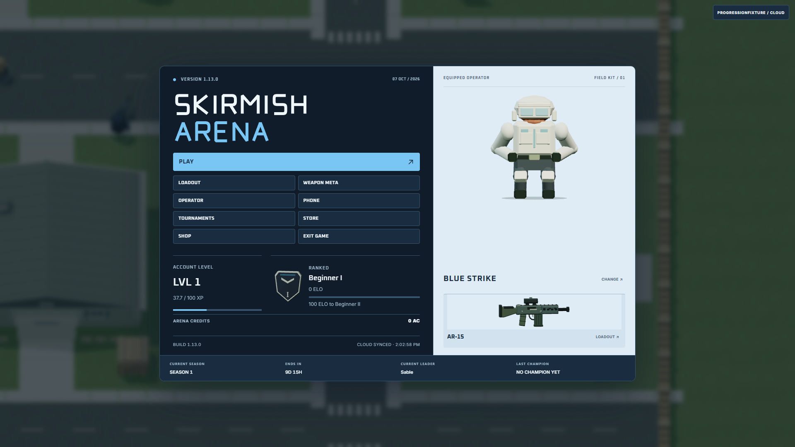

# Skirmish Arena

A tactical arena shooter with a persistent league of 50 bots. Pick a loadout, play a match, and watch rivalries, careers and seasons develop around you.

**1.13.0 — ARENA REFINED · Weapon Balance 9.0 · Beta**

[Download for Windows (64-bit)](https://github.com/nhicksenterprises2025-maker/skirmish-arena-official-game/releases/latest) — choose the Windows setup file from the latest published release.



## Install

1. Download the Windows installer above.
2. Run it, then open **Skirmish Arena** from your desktop or Start menu.
3. Press **Play**, create an account or sign in, and choose a mode.

The installer includes the game's required local runtime. You do not need Node, a terminal or a separately started game server to play. Windows WebView2 is required; setup handles it when needed. The current installer does not have a Windows publisher certificate.

For an existing installation, run the new installer over it. Accounts and save data stay outside the game files. Keep your recovery code and use **Settings → Account → Data Management** to export a backup before moving to another PC.

## The game

- **Ranked and ordinary 5v5 Team Deathmatch, ten-player Deathmatch and custom matches.** Practice alone or choose a bot roster and difficulty.
- **A league that remembers.** Fifty bots keep their careers, weapon familiarity, form and season history.
- **Four background match slots.** Two TDM and two Deathmatch slots rotate fairly through the 50-bot roster. Switch matches, follow individual bots or use the tactical camera.
- **Fifteen weapons and cosmetic operators.** Inspect the 2.5D models, build a primary/sidearm loadout and follow the current Weapon Meta.
- **Account progression.** Earn XP through eligible matches and progress through Levels 1–50. Lifetime XP keeps accumulating at the cap.
- **Tournaments and Phone.** Register teams, follow brackets, invite bots and inspect live scores and bot records. Phone retains Live Scores, Spectate, Bot Leaderboard and Bot Weapon Meta.

The game is built around bot opponents. A hosted account connection is for accounts and synchronization; it is not human-versus-human online multiplayer.

## Playing and saving

Aim with the mouse; gameplay captures it and menus release it. Open **Settings → Game → Controls** for bindings and sensitivity. **Tab** shows the combat scoreboard and **F11** toggles fullscreen.

Previously authenticated accounts can use their cached world when the account connection is unavailable. The game shows **CLOUD OFFLINE — LOCAL MODE**, keeps saving locally and synchronizes when the connection returns. First-time login and account creation require a working account service. The desktop app starts its included local service automatically.

Your username menu opens **Player Profile** and **Settings**. Settings has four tabs: **Game**, **Audio**, **Account** and **About**. Backups are under **Account → Data Management**. Open **Phone** for Live Scores, Spectate, Bot Leaderboard and Bot Weapon Meta.

The [player guide](docs/PLAYER-GUIDE.md) covers modes, careers, seasons, tournaments, Phone and backups.

## Arena Refined

Build **1.13.0** combines all ten Arena Refined audits. Mode entry prepares the match for at least three seconds before its countdown. Phone keeps its four live-statistics and spectator apps; the conversation feature is retired with recoverable data archives.

A $0.50 Polar Camo offer is available for Sandbox payment testing when its service is configured. Public real-money checkout remains unavailable. Returning from checkout does not grant credits or an appearance by itself; delivery requires verification.

Application version **1.13.0**, analytics schema **1**, and Weapon Balance **9.0** are separate. Full historical notes remain available in **Settings → About** and [version.json](version.json).

AK magazine details stay attached, the lobby display moves subtly, stat bars show performance in color and combat panels use neutral surfaces. Click a dimensional ranked emblem to inspect the current ladder and Ranked Stats. Combined Stats uses unique casual TDM, casual Deathmatch and Ranked TDM records; tournaments, custom sessions and practice remain excluded.

Skirmish Challenge Tournament runs every three calendar days at 7:30 PM Eastern, with daylight saving. Check in during the first 90 seconds of each two-minute preparation block. Play all three quarterfinal and semifinal games and all five final games; total kills decide advancement, followed by team damage if tied. Event pages show the fixed schedule, connected bracket, tournament-only leaderboards and official history.

Balance 9.0 adds the semi-automatic FAL. Ranges use meters without changing the map's size or physical weapon behavior. Current-patch telemetry starts clean while lifetime records and previous patches remain available. The [player guide](docs/PLAYER-GUIDE.md) covers schedules, permanent no-show replacements, rewards and statistical eligibility.

## Source and builds

This repository contains the game, desktop launcher, account service, tests, runtime assets, editable Blender files and asset tools.

[Download source ZIP](https://github.com/nhicksenterprises2025-maker/skirmish-arena-official-game/archive/refs/heads/main.zip), or clone:

```sh
git clone https://github.com/nhicksenterprises2025-maker/skirmish-arena-official-game.git
```

See [Building from source](docs/BUILDING.md) for setup and tests. The large original audio library is a separate release download; it is needed only to rebuild audio, not to run or package the game. Personal saves, credentials, signing keys, dependencies and generated installers are kept out of Git.

Third-party notices are included in [the audio credits](assets/audio/LICENSES.json) and [the renderer license](vendor/THREE-LICENSE.txt), and [font licenses](assets/fonts/README.md).

## Problems and feedback

[Open an issue](https://github.com/nhicksenterprises2025-maker/skirmish-arena-official-game/issues) with your game build, Windows version, what happened and how to reproduce it. A screenshot or the first error from the startup log helps. Leave passwords, recovery codes and private save files out of public reports.
