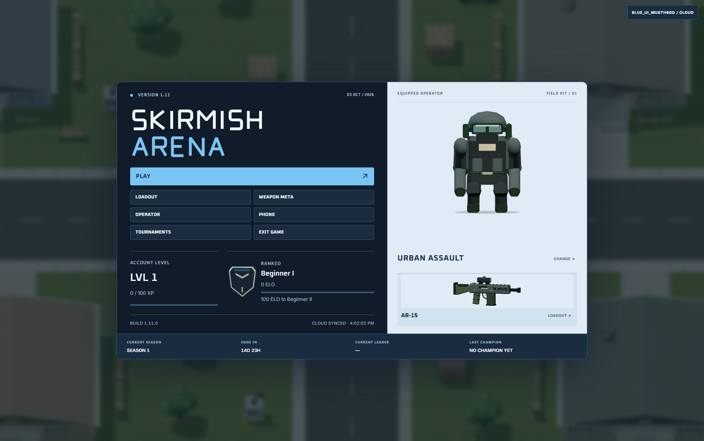

# Skirmish Arena

A tactical arena shooter with a persistent league of 50 bots. Pick a loadout, play a match, and watch rivalries, careers and seasons develop around you.

**Version 1.11 · Windows build 1.11.0 · Weapon Balance 8.0 · Beta**

[Download for Windows (64-bit)](https://github.com/nhicksenterprises2025-maker/skirmish-arena-official-game/releases/latest/download/Skirmish.Arena.Reimagined_1.11.0_x64-setup.exe) · [Release notes and downloads](https://github.com/nhicksenterprises2025-maker/skirmish-arena-official-game/releases/latest)



## Install

1. Download the Windows installer above.
2. Run it, then open **Skirmish Arena** from your desktop or Start menu.
3. Press **Play**, create an account or sign in, and choose a mode.

The installer includes the game's required local runtime. You do not need Node, a terminal or a separately started game server to play. Windows WebView2 is required; setup handles it when needed. The current installer does not have a Windows publisher certificate.

For an existing installation, run the new installer over it. Accounts and save data stay outside the game files. Keep your recovery code and use **Settings → Account → Data Management** to export a backup before moving to another PC.

## The game

- **Ranked and ordinary 5v5 Team Deathmatch, ten-player Deathmatch and custom matches.** Practice alone or choose a bot roster and difficulty.
- **A league that remembers.** Fifty bots keep their careers, weapon familiarity, form and season history.
- **Four live matches to watch.** Switch matches, follow individual bots or use the tactical camera.
- **Fourteen weapons and cosmetic operators.** Inspect the 2.5D models, build a primary/sidearm loadout and follow the current Weapon Meta.
- **Account progression.** Earn XP through eligible matches and progress through Levels 1–50. Lifetime XP keeps accumulating at the cap.
- **Tournaments and Phone.** Register teams, follow brackets, invite bots and keep up with their conversations.

The current release is built around bot opponents. A hosted account connection is for accounts and synchronization; it is not human-versus-human online multiplayer.

## Playing and saving

Aim with the mouse; gameplay captures it and menus release it. Open **Settings → Game → Controls** for bindings and sensitivity. **Tab** shows the combat scoreboard and **F11** toggles fullscreen.

Previously authenticated accounts can use their cached world when the account connection is unavailable. The game shows **CLOUD OFFLINE — LOCAL MODE**, keeps saving locally and synchronizes when the connection returns. First-time login and account creation require a working account service. The desktop app starts its included local service automatically.

Bot replies use an optional local dialogue service. Its availability is separate from the account connection, and it is not required to play matches. The installer does not download the dialogue model.

Your username menu opens **Player Profile** and **Settings**. Settings has four tabs: **Game**, **Audio**, **Account** and **About**. Backups are under **Account → Data Management**. Open **Phone** for Messages, Live Scores, Spectate, Bot Leaderboard and Bot Weapon Meta.

The [player guide](docs/PLAYER-GUIDE.md) covers modes, careers, seasons, tournaments, Phone and backups.

## Current release: Blue Circuit

Build **1.11.0** adds Ranked TDM with a separate 26-rank ELO ladder for players and named bots. Level and rank progress have their own lobby panels and match breakdowns. The existing XP curve stays the same; a new 5,000-damage reward tier joins the scoring schedule.

Every weapon and operator card has its own rotation, Reset and zoom controls. Exact stat bars, modeled rank crests and clearer typography carry through the existing blue interface.

Phone contacts speak as competitors: their own reactions, rivalries, weapon opinions and rank grind. Factual replies use current game records, and a failed generation stays in the normal retry flow. Conversation history and personalities carry forward.

Application version **1.11**, analytics schema **1**, and weapon balance **8.0** are separate. This release does not change weapon values or reset telemetry. Full history is available in **Settings → About** and [version.json](version.json).

## Source and builds

This repository contains the game, desktop launcher, account service, tests, runtime assets, editable Blender files and asset tools.

[Download source ZIP](https://github.com/nhicksenterprises2025-maker/skirmish-arena-official-game/archive/refs/heads/main.zip), or clone:

```sh
git clone https://github.com/nhicksenterprises2025-maker/skirmish-arena-official-game.git
```

See [Building from source](docs/BUILDING.md) for setup and tests. The large original audio library is a separate release download; it is needed only to rebuild audio, not to run or package the game. Personal saves, credentials, signing keys, dependencies and generated installers are kept out of Git.

Third-party notices are included in [the audio credits](assets/audio/LICENSES.json) and [the renderer license](vendor/THREE-LICENSE.txt), and [font licenses](assets/fonts/README.md).

## Problems and feedback

[Open an issue](https://github.com/nhicksenterprises2025-maker/skirmish-arena-official-game/issues) with your game build, Windows version, what happened and how to reproduce it. A screenshot or the first error from the startup log helps. Leave passwords, recovery codes and private save files out of public reports.
